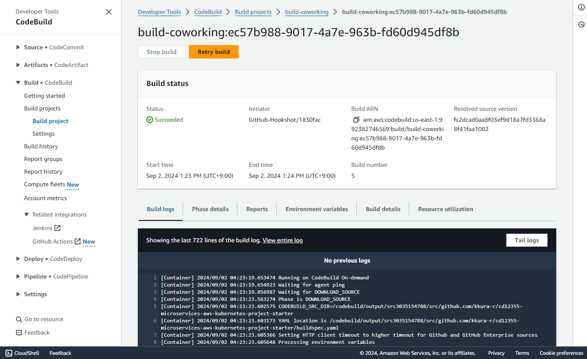
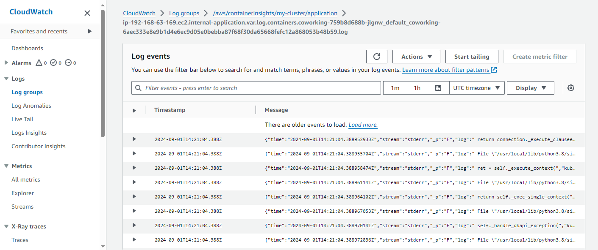

# Coworking Space Service Extension

The Coworking Space Service is a set of APIs that enables users to request one-time tokens and administrators to authorize access to a coworking space. This service follows a microservice pattern and the APIs are split into distinct services that can be deployed and managed independently of one another.

For this project, you are a DevOps engineer who will be collaborating with a team that is building an API for business analysts. The API provides business analysts basic analytics data on user activity in the service. The application they provide you functions as expected locally and you are expected to help build a pipeline to deploy it in Kubernetes.

## Folders

- `analytics/` - analytics application
- `db/` - SQL queries to initialize a database
- `deployments/` - Kubernetes (k8s) manifest files
- `screenshots/` - screenshots

## Getting Started

### Dependencies

#### Local Environment

1. Python (>3.6) - run an analytics application of a database
2. Docker CLI - build and Docker images locally
3. `kubectl` - run commands againt a Kubernetes (k8s) cluster

#### Remote Resources

Amazon Web Service (AWS) services are used for deployment.

1. AWS CodeBuild - build Docker images remotely
2. AWS ECR - host Docker images
3. AWS EKS - run application in k8s
4. AWS CloudWatch - monitor activity and logs in EKS
5. GitHub - pull and clone code

### Deployment Process

1. Push your modification to the remote repository.
2. Execute build pipeline with AWS CodeBuild. An application container image is built and stored in AWS ECR.
3. Create AWS EKS cluster for the application platform.
4. Configure a database volume into the cluster with k8s.
5. Create a Postgres service used for the database connection with k8s. The service can be exposed by using port-forwarding approach.
6. Deploy the analytics application with k8s from the stored container image in AWS ECR.
7. For monitoring, attach the Amazon CloudWatchObservability add-on to the EKS cluster. You can check the status of the working clusters by using the Container Insights feature in AWS CloudWatch.

AWS resources are based on pay for running time of the service and amount of the storages.

You can save the cost if...
- Terminate unnecessary working clusters
- Remove redundant storages
- Select minimal compuing resouces and storage volumes

You can check the estimate cost by using [AWS Pricing Calculator](https://calculator.aws/#/).

### Startup

#### Prerequisites

- Establish connection to AWS service account (by `aws configure`).
- Create a container repository in AWS ECR. It is named as `coworking` in this repository.
- Create a build pipeline in AWS CodeBuild.
    - Set this Github repository for the source provider.
    - Use a buildspec file in this repository.
    - You can trigger a pipeline automatically by the event (e.g. push to the repository)

- Execute the build pipeline and confirm the container image is built.

    You can check the build process succeeded in AWS Console:

    

    and also the container in the AWS ECR.

    

#### 1. Create a EKS Cluster

Create a new EKS cluster with

```sh
$ eksctl create cluster --name my-cluster --region us-east-1 --nodegroup-name my-nodes \
    --node-type t3.small --nodes 1 --nodes-min 1 --nodes-max 2
```

In the above commands, the cluster is configured as

- Cluster name - `my-cluster`
- Region - `us-east-1`
- Nodegroup name - `my-nodes`
- Node type - `t3.small`
- Initial num. of nodes - 1
- Mininum num. of nodes - 1
- Maxinum num. of nodes - 2

Update configuration with

```sh
$ aws eks --region us-east-1 update-kubeconfig --name my-cluster
```

You can verify the current context name with

```sh
$ kubectl config current-context
```

The cluster can be closed with

```sh
$ eksctl delete cluster --name my-cluster --region us-east-1
```

#### 2. Configure a Database

Configure a database by using manifest files in `deployments`.

1. Create the storages

    ```sh
    $ kubectl apply -f deployments/pvc.yaml
    $ kubectl apply -f deployments/pv.yaml
    ```

2. Create a Postgres deployment

    ```sh
    $ kubectl apply -f deployments/postgresql-deployment.yaml
    ```

3. Configure parameters requried for database access

    ```sh
    $ kubectl apply -f deployments/configmap.yaml
    ```

    In `ConfigMap`, following parameters are declared

    - `DB_USERNAME` (defaults to `myuser`)
    - `DB_HOST` (defaults to `127.0.0.1`)
    - `DB_PORT` (defaults to `5432`)
    - `DB_NAME` (defaults to `postgres`)

    And password used for the database access `DB_PASSWORD` is declared as k8s `Secrets`. It is stored in base64 encoded string (defaults to `mypassword`)

4. Create a Postgres service

    ```sh
    $ kubectl apply -f deployments/postgresql-service.yaml
    ```

    Expose the port by using port-forwarding with

    ```sh
    $ kubectl port-forward --namespace default svc/postgresql-service 5433:5432 &
    ```

    The above command opens up port-forwarding from your local environment's port 5433 to the node's port 5432 (in background).

5. Run seed files

    You can check the database access by running seed files.
    Install requirements with

    ```sh
    $ apt update
    $ apt install postgresql postgresql-contrib
    ```

    and run the seed files with

    ```sh
    $ cd db/
    $ export DB_PASSWORD=mypassword
    PGPASSWORD="$DB_PASSWORD" psql --host 127.0.0.1 -U myuser -d mydatabase -p 5433 < 1_create_tables.sql
    PGPASSWORD="$DB_PASSWORD" psql --host 127.0.0.1 -U myuser -d mydatabase -p 5433 < 2_seed_users.sql
    PGPASSWORD="$DB_PASSWORD" psql --host 127.0.0.1 -U myuser -d mydatabase -p 5433 < 3_seed_tokens.sql
    cd ..
    ```

    You can open the psql terminal with

    ```sh
    $ PGPASSWORD="$DB_PASSWORD" psql --host 127.0.0.1 -U myuser -d mydatabase -p 5433
    ```

    and run queries to verify the entries.

    Quit the terminal with a command: `\q`.

6. Close the forwarded port

    ```sh
    $ ps aux | grep 'kubectl port-forward' | grep -v grep | awk '{print $2}' | xargs -r kill
    ```

7. Resume the project

    You can re-attach later to running cluster with

    ```
    # Set the AWS credendials
    $ aws configure

    # Update the context in the local config file
    $ aws eks --region us-east-1 update-kubeconfig --name my-cluster

    # Get context name
    $ kubectl config current-context

    # Find the service name of postgresql by listing your services
    kubectl get svc

    # Set up port-forwarding for the postgresql service
    kubectl port-forward svc/postgresql-service 5433:5432 &
    ```

#### 3. Build the Analytics Application Locally

In the `analytics/` directory

1. Install dependencies

    ```bash
    $ pip install -r requirements.txt
    ```

2. Run the application (see below regarding environment variables)

    ```bash
    $ <ENV_VARS> python app.py
    ```

    There are multiple ways to set environment variables in a command.
    They can be set per session by running `export KEY=VAL` in the command line or they can be prepended into your command.

    - `DB_USERNAME`
    - `DB_PASSWORD`
    - `DB_HOST` (defaults to `127.0.0.1`)
    - `DB_PORT` (defaults to `5432`)
    - `DB_NAME` (defaults to `postgres`)

    If we set the environment variables by prepending them, it would look like the following:

    ```bash
    $ DB_USERNAME=username_here DB_PASSWORD=password_here python app.py
    ```

    The benefit here is that it's explicitly set. However, note that the `DB_PASSWORD` value is now recorded in the session's history in plaintext. There are several ways to work around this including setting environment variables in a file and sourcing them in a terminal session.

3. Verifying The Application

    - Generate report for check-ins grouped by dates: `curl <BASE_URL>/api/reports/daily_usage`
    - Generate report for check-ins grouped by users: `curl <BASE_URL>/api/reports/user_visits`

#### 4. Deploy the Analysis Application

Deploy the analytics application with

```sh
$ kubectl apply -f deployments/coworking.yaml
```

You can check running applications like as

- Pods

    

- Services

    


#### 5. CloudWatch

You can monitor performance status with AWS CloudWatch and Container Insights feature.

- [Setting up Container Insights on Amazon EKS and Kubernetes - AWS](https://docs.aws.amazon.com/AmazonCloudWatch/latest/monitoring/deploy-container-insights-EKS.html)



I had some troubles while checking Container Insights and resolve with following references:

- [(Japanese page) Amazon EKS に Container Insights を導入する手順をまとめてみた](https://nobelabo.hatenablog.com/entry/2023/04/10/084004#agenda1)
- [Quick Start with the CloudWatch agent operator and Fluent Bit - AWS](https://docs.aws.amazon.com/AmazonCloudWatch/latest/monitoring/Container-Insights-setup-EKS-quickstart.html#Container-Insights-setup-EKS-quickstart-FluentBit)
